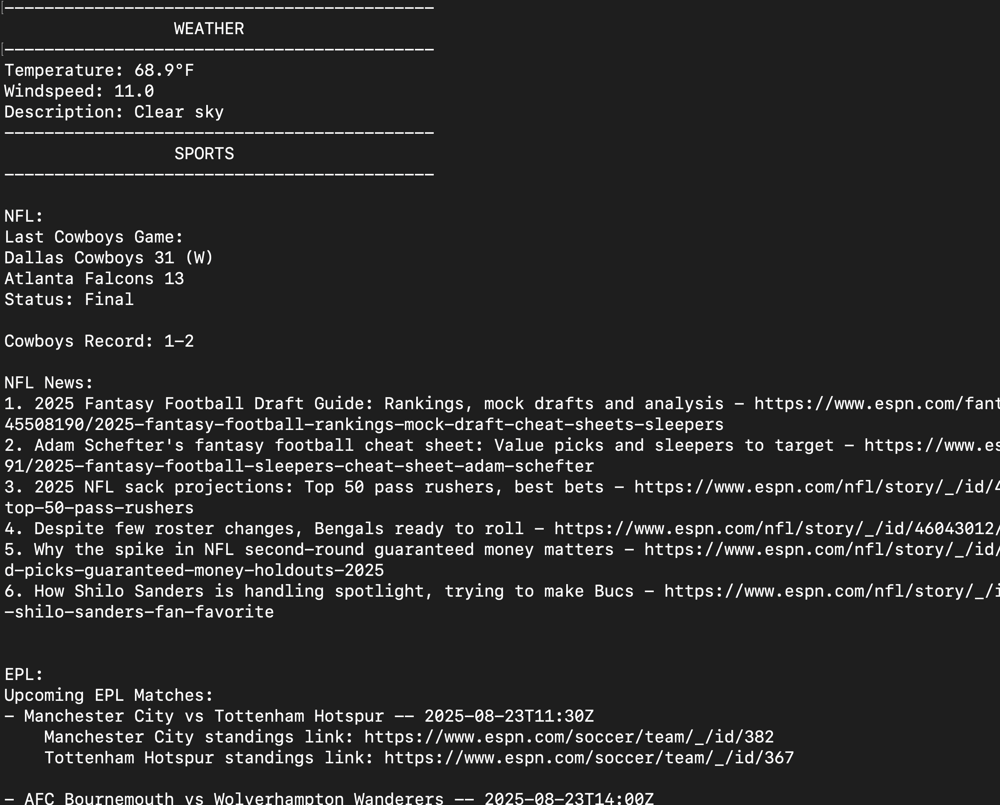

# news
Python client to get news (Tech, Sports, Politics, etc...)

## Usage
Once installed, run "news" in the command line and the program will output a customized newsfeed with headlines 


## Setup
1. Pull the repository
```bash
# pull a specific version
## dont select branch or select "main" if you want whatever is latest
git clone --branch <version> https://github.com/ktierney15/news.git
```
2. Customize to your hearts content. Change your favorite teams, include or exclude certain news types, etc...
3. Set up a virtual environment to run locally and install
```bash
cd news
python3 -m venv .venv
```
4. Run installation script
```bash
sh install.sh
```

## CLI usage
coming soon...

## UI usage
coming soon...

